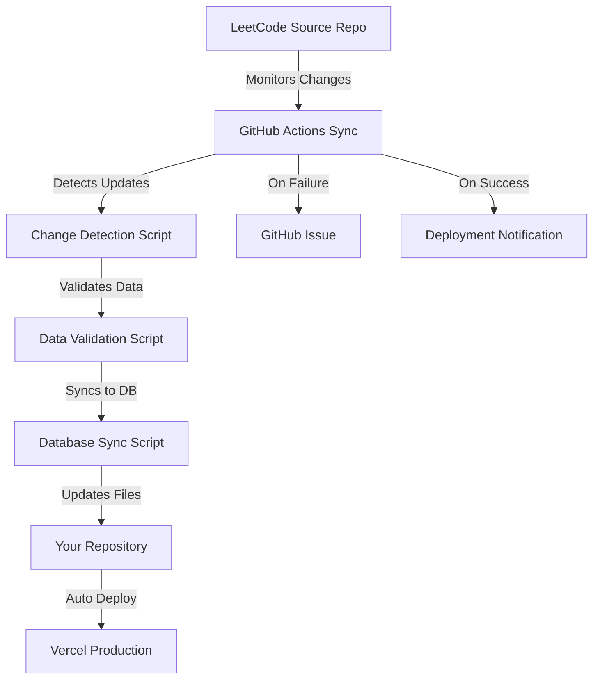

# 🔄 LeetCode Data Sync System

This guide explains the automated synchronization system that keeps your LeetCode Nexus application up-to-date with the latest problems from the [LeetCode Questions CompanyWise](https://github.com/krishnadey30/LeetCode-Questions-CompanyWise) repository.

## 🏗️ System Architecture



## ⚙️ Components Overview

### 1. **GitHub Actions Workflow** (`.github/workflows/sync-leetcode-data.yml`)
- **Schedule**: Runs daily at 6 AM UTC
- **Triggers**: Manual trigger, repository dispatch events
- **Jobs**: Check updates → Sync data → Deploy → Notify

### 2. **Core Scripts**
- **`scripts/detect-changes.js`**: Compares source vs current data
- **`scripts/validate-data.js`**: Validates CSV data integrity  
- **`scripts/sync-database.js`**: Syncs data to PostgreSQL database
- **`scripts/generate-companies-list.js`**: Generates companies metadata

### 3. **Database Schema**
- **Companies**: Tracks company information and status
- **Problems**: Stores structured problem data with relationships
- **SyncLog**: Records synchronization history and metadata

## 🚀 How It Works

### Phase 1: Change Detection
1. **Clone Source Repository**: Downloads latest LeetCode data
2. **Compare Data**: Checks file hashes and modification times
3. **Identify Changes**: Detects new, updated, or removed companies
4. **Generate Report**: Creates detailed change summary

### Phase 2: Data Validation
1. **Structure Validation**: Ensures CSV files have correct columns
2. **Data Integrity**: Validates problem data (difficulty, frequency, etc.)
3. **Completeness Check**: Verifies all required files are present
4. **Error Reporting**: Reports any data quality issues

### Phase 3: Database Synchronization
1. **Parse CSV Files**: Reads and processes problem data
2. **Company Management**: Updates company records and status
3. **Problem Upserts**: Adds new problems and updates existing ones
4. **Cleanup**: Marks inactive companies and old data
5. **Metadata Recording**: Logs sync statistics and errors

### Phase 4: Deployment & Notification
1. **File Updates**: Commits new data to repository
2. **Trigger Deployment**: Initiates Vercel production deployment
3. **Success Notification**: Reports sync statistics
4. **Error Handling**: Creates GitHub issues for failures

## 📊 Sync Statistics & Monitoring

### Database Tracking
Every sync operation records:
- Companies processed count
- Problems added/updated/skipped
- Error count and details
- Execution duration
- Status (SUCCESS, FAILED, COMPLETED_WITH_ERRORS)

### Sync Status Monitoring
```sql
-- View recent sync history
SELECT 
  status,
  companiesProcessed,
  problemsAdded,
  problemsUpdated,
  errorsCount,
  createdAt
FROM sync_logs 
ORDER BY createdAt DESC 
LIMIT 10;
```

## 🛠️ Manual Operations

### Manual Sync Trigger
```bash
# Trigger sync via GitHub Actions
curl -X POST \
  -H "Authorization: token YOUR_GITHUB_TOKEN" \
  -H "Accept: application/vnd.github.v3+json" \
  https://api.github.com/repos/YOUR_USERNAME/YOUR_REPO/actions/workflows/sync-leetcode-data.yml/dispatches \
  -d '{"ref":"main","inputs":{"force_sync":"true"}}'
```

### Local Testing
```bash
# Test change detection
node scripts/detect-changes.js path/to/source path/to/current

# Validate data integrity
node scripts/validate-data.js public/data

# Run database sync (requires DATABASE_URL)
node scripts/sync-database.js

# Generate companies list
node scripts/generate-companies-list.js public/data
```

### Database Management
```bash
# View sync logs
npx prisma studio

# Run migrations
npx prisma migrate deploy

# Reset database (caution!)
npx prisma migrate reset
```

## 🔧 Configuration

### Environment Variables
```bash
# Required for sync operations
DATABASE_URL=postgresql://...
VERCEL_TOKEN=your-vercel-token
VERCEL_PROJECT_ID=your-project-id

# Source repository (configurable)
LEETCODE_REPO_URL=https://github.com/krishnadey30/LeetCode-Questions-CompanyWise
```

### Sync Schedule
The sync runs daily at 6 AM UTC. To modify:

```yaml
# .github/workflows/sync-leetcode-data.yml
schedule:
  - cron: '0 6 * * *'  # Change time here
```

### Data Sources
Currently syncs from: `krishnadey30/LeetCode-Questions-CompanyWise`

To change source repository, update `LEETCODE_REPO_URL` in the workflow.

## 🚨 Error Handling & Troubleshooting

### Common Issues

1. **Source Repository Unavailable**
   - Check if source repo is accessible
   - Verify repository URL is correct
   - Network connectivity issues

2. **Database Connection Failed**
   - Verify `DATABASE_URL` is correct
   - Check database server status
   - Ensure database has required permissions

3. **Data Validation Errors**
   - CSV format changes in source
   - Missing required columns
   - Invalid data values

4. **Deployment Failures**
   - Vercel token expired
   - Build errors in production
   - Environment variables missing

### Debugging Steps

1. **Check Workflow Logs**
   ```bash
   # View in GitHub Actions tab
   https://github.com/YOUR_USERNAME/YOUR_REPO/actions
   ```

2. **Examine Sync Logs**
   ```sql
   SELECT * FROM sync_logs WHERE status = 'FAILED' ORDER BY createdAt DESC;
   ```

3. **Manual Validation**
   ```bash
   # Test data validation locally
   node scripts/validate-data.js public/data
   ```

4. **Database Health Check**
   ```bash
   # Test database connection
   npx prisma db push --preview-feature
   ```

## 📈 Performance & Optimization

### Sync Performance
- **Incremental Updates**: Only processes changed files
- **Batch Operations**: Efficient database upserts
- **Error Recovery**: Continues processing after individual failures
- **Resource Limits**: GitHub Actions 6-hour timeout

### Database Optimization
- **Indexes**: Optimized queries for company/problem lookups
- **Constraints**: Prevents duplicate data
- **Cleanup**: Automatic removal of old sync logs
- **Connection Pooling**: Efficient database connections

## 🔒 Security Considerations

### Access Control
- GitHub Actions uses repository secrets
- Database access restricted to sync operations
- No sensitive data in sync logs

### Data Integrity
- Validation before database updates
- Backup creation before major changes
- Rollback capabilities for failed syncs

### Monitoring
- Failed sync notifications via GitHub issues
- Detailed error logging for debugging
- Audit trail of all sync operations

## 🎯 Benefits

✅ **Always Up-to-Date**: Latest LeetCode problems automatically available  
✅ **Zero Maintenance**: Fully automated sync process  
✅ **Error Recovery**: Robust error handling and notifications  
✅ **Data Integrity**: Comprehensive validation and backup  
✅ **Performance**: Efficient incremental updates  
✅ **Monitoring**: Detailed logging and statistics  
✅ **Flexibility**: Manual trigger and configuration options  

## 🔮 Future Enhancements

- **Multiple Source Repositories**: Support for additional data sources
- **Real-time Sync**: Webhook-based instant updates
- **Data Analytics**: Trend analysis and insights
- **Custom Filters**: Selective company/timeframe syncing
- **Performance Metrics**: Detailed timing and resource usage
- **Notification Channels**: Slack, Discord, or email notifications

---

**Your LeetCode Nexus now automatically stays synchronized with the latest problem data!** 🚀 