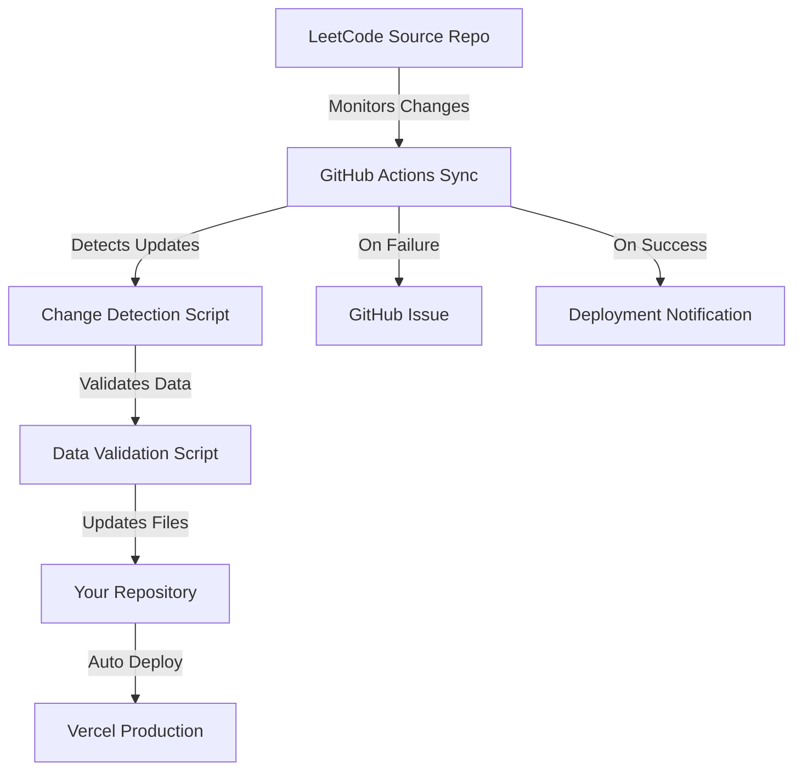

# 🔄 LeetCode Data Sync System

This guide explains the automated synchronization system that keeps your LeetCode Nexus application up-to-date with the latest problems from the [LeetCode Questions CompanyWise](https://github.com/krishnadey30/LeetCode-Questions-CompanyWise) repository.

## 🏗️ Simplified Architecture



## ⚙️ Components Overview

### 1. **GitHub Actions Workflow** (`.github/workflows/sync-leetcode-data.yml`)
- **Schedule**: Runs daily at 6 AM UTC
- **Triggers**: Manual trigger, repository dispatch events
- **Jobs**: Check updates → Sync data → Deploy → Notify

### 2. **Core Scripts**
- **`scripts/detect-changes.js`**: Compares source vs current data
- **`scripts/validate-data.js`**: Validates CSV data integrity  
- **`scripts/generate-companies-list.js`**: Generates companies metadata

### 3. **Data Storage**
- **Local Files**: CSV files stored in `/public/data/`
- **Client Storage**: User progress stored in browser's local storage
- **No Database**: Simplified architecture without server-side storage

## 🚀 How It Works

### Phase 1: Change Detection
1. **Clone Source Repository**: Downloads latest LeetCode data
2. **Compare Data**: Checks file hashes and modification times
3. **Identify Changes**: Detects new, updated, or removed companies
4. **Generate Report**: Creates detailed change summary

### Phase 2: Data Validation
1. **Structure Validation**: Ensures CSV files have correct columns
2. **Data Integrity**: Validates problem data (difficulty, frequency, etc.)
3. **Completeness Check**: Verifies all required files are present
4. **Error Reporting**: Reports any data quality issues

### Phase 3: File Synchronization
1. **Update Repository**: Commits new CSV files to your repository
2. **Maintain Structure**: Preserves directory organization
3. **Generate Metadata**: Creates company list and statistics
4. **Trigger Deployment**: Automatic Vercel deployment

### Phase 4: Deployment & Notification
1. **Automatic Deploy**: Vercel deploys updated application
2. **Webhook Notification**: Optional webhook for sync completion
3. **Error Handling**: Creates GitHub issues for failures
4. **Status Updates**: Posts deployment status

## 📁 Directory Structure

```
public/data/
├── Accenture/
│   ├── 1. Thirty Days.csv
│   ├── 2. Three Months.csv
│   ├── 3. Six Months.csv
│   ├── 4. More Than Six Months.csv
│   └── 5. All.csv
├── Adobe/
│   └── ... (same structure)
└── ... (other companies)
```

## 🔧 Configuration

### Environment Variables

**Required for Sync Pipeline:**
```env
WEBHOOK_SECRET=your-webhook-secret-for-data-sync
```

**Optional for Enhanced Features:**
```env
VERCEL_TOKEN=your-vercel-token
VERCEL_ORG_ID=your-vercel-org-id
VERCEL_PROJECT_ID=your-vercel-project-id
```

### Manual Sync

You can manually trigger a sync using:

```bash
# Manual sync script
npm run sync

# Or trigger via API
curl -X POST https://your-app.vercel.app/api/sync-data \
  -H "Content-Type: application/json" \
  -H "x-webhook-secret: your-webhook-secret"
```

## 📊 Sync Status API

### Endpoint: `/api/sync-data`

**Method**: POST
**Headers**: 
- `x-webhook-secret`: Your webhook secret
- `Content-Type: application/json`

**Response**:
```json
{
  "success": true,
  "message": "Data sync completed successfully",
  "timestamp": "2024-01-15T10:30:00Z",
  "stats": {
    "companies_processed": 150,
    "files_updated": 75,
    "errors": 0
  }
}
```

## 🛠️ Troubleshooting

### Common Issues

1. **Sync Failures**
   - Check GitHub Actions logs
   - Verify webhook secret is correct
   - Ensure repository permissions are sufficient

2. **Data Not Updating**
   - Verify `/public/data` directory structure
   - Check if source repository has new commits
   - Test manual sync command

3. **Deployment Issues**
   - Check Vercel deployment logs
   - Verify build process completes successfully
   - Ensure no CSV parsing errors

### Manual Recovery

If automated sync fails, you can manually update:

```bash
# 1. Clone source repository
git clone https://github.com/krishnadey30/LeetCode-Questions-CompanyWise.git temp-source

# 2. Copy data to your repository
cp -r temp-source/* public/data/

# 3. Commit and push
git add public/data
git commit -m "Manual data sync"
git push
```

## 🎯 Benefits

### For Users
- ✅ **Always Current**: Latest problem sets automatically
- ✅ **No Maintenance**: Zero user intervention required
- ✅ **Reliable**: Automated validation and error handling
- ✅ **Fast**: Client-side data loading

### For Developers
- ✅ **Simplified**: No database management
- ✅ **Scalable**: Static files scale infinitely
- ✅ **Maintainable**: Clear separation of concerns
- ✅ **Cost-effective**: No database hosting costs

## 📈 Monitoring

### GitHub Actions
Monitor sync status in your repository's Actions tab:
- ✅ Daily sync runs at 6 AM UTC
- 📊 View detailed logs and execution times
- 🚨 Automatic issue creation on failures

### Vercel Deployments
Track deployments in Vercel dashboard:
- 🚀 Automatic deployments on data updates
- 📱 Preview deployments for testing
- 📊 Performance metrics and analytics

## 🔄 Future Enhancements

The sync system is designed to be extensible:

1. **Multiple Sources**: Support for additional problem sources
2. **Custom Filters**: Company-specific problem filtering
3. **Advanced Validation**: Enhanced data quality checks
4. **Rollback Support**: Automatic rollback on validation failures
5. **Real-time Updates**: WebSocket-based live updates

---

## 🎉 Summary

The simplified sync system provides:
- 🔄 **Automated Updates**: Daily synchronization with source repository
- 📁 **File-based Storage**: No database complexity
- 🚀 **Fast Deployment**: Instant updates via Vercel
- 🛡️ **Error Handling**: Robust validation and recovery
- 📊 **Monitoring**: Complete visibility into sync process

Your LeetCode Nexus stays automatically updated with zero maintenance! 🎯 